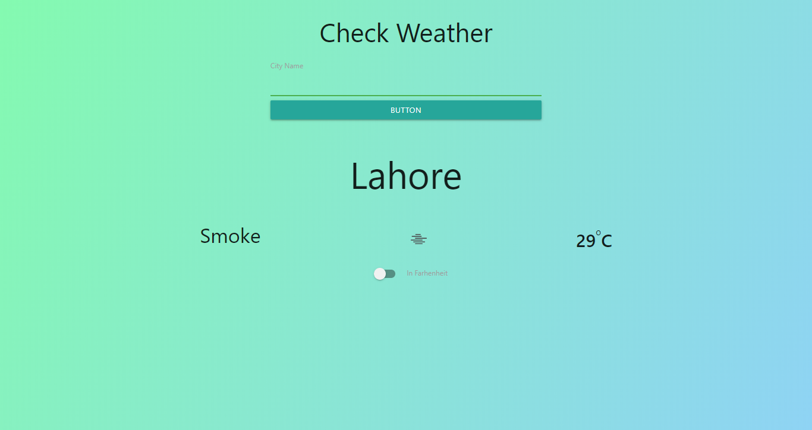

<h1 align="center">
  <br>
    Wheather App
  <br>
</h1>

<h4 align="center">This project is about getting wheather using the API of <a href="https://openweathermap.org/" target="_blank"> OpenWeather website.</a> User can get wheather information of any desired city by typing it's name
</h4>
</br>


</br>

<p align="center">
  <a href="#key-features">Key Features</a> •
  <a href="#how-to-use">How To Use</a> •
  <a href="#credits">Credits</a> •
  <a href="#related">Related</a> •
  <a href="#license">License</a>
</p>


## Key Features

* User can Search by Any city name to get Weather
* Wheather can be get with both scale Farhenheit and centigrade.
* API interaction with openWheather.com

## How To Use

```bash
# Clone this repository
$ git clone https://github.com/TashfeenRao/weather-app

# Go into the repository
$ cd weather-app

# Install dependencies
$ npm install

# Run the app
$ npm start
```

## Screen Shot



## Live version

https://tashfeenrao.github.io/weather-app/.

## Emailware

Weather App is an Open source. if you liked using this app or it has helped you in any way, I'd like you send me an email at <raotashfeen25@gmail.com> about anything you'd want to say about this software. I'd really appreciate it!

## Credits

This software uses the following open source packages:

- [Node.js](https://nodejs.org/)
- [Webpack](https://webpack.js.org/)
- [Babel](https://babeljs.io/)
- [Jest](https://jestjs.io/)
- [Microverse](http://microverse.org/)
- [Odin Project](https://www.theodinproject.com/)

## License

MIT

---
> [Tashfeen Rao](https://tashfeenrao.github.io/personal-portfolio/) &nbsp;&middot;&nbsp;
> GitHub [TashfeenRao](https://github.com/TashfeenRao) &nbsp;&middot;&nbsp;
> Twitter [@TashfeenRao2](https://twitter.com/TashfeenRao2)
